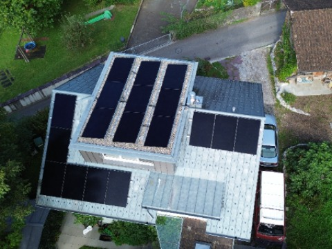

# gizstrom

<table>
    <tr>
      <td style="vertical-align: top; width: 50%;">
        Solar panels are a great way to generate renewable energy. We recently installed a solar panel system on our roof. While the manufacturers provides an app to monitor energy generation, it unfortunatly lacks forecasting capabilities. This project aims to bridge that gap by creating a machine learning pipeline that predicts future energy generation based on weather forecasts and historical data. The solution includes data processing, model training, and a simple web app for visualization.
      </td>
      <td style="width: 30%;">
        
      </td>
    </tr>
  </table>

## Data Sources

- **Open Meteo Weather API**: Provides both historical and forecast weather data, including features like temperature, rainfall, and radiation. There is historical data available as well as a forecast for next few days. This project uses the historical data for training the model and the forecast data for making predictions.
- **Fronius Solar Web**: Supplies daily power generation statistics from the solar installation. This data serves as the labels for the machine learning model. As this data is only available for Users with a Fronius solar installation, an example export of the data is included (`example_data/fronius_export.csv`). _This data has to be manually uploaded via the App._

## System Architecture and FTI-Pipeline

<table >
    <tr>
        <td style="padding: 30px;">
            
        </td>
        <td style="padding: 30px;">
            
        </td>
    </tr>
</table>

## Project Structure

- **`src/`**: Contains the source code for the app, the code for the pipelines and the Airflow DAGs.
- **`infra/`**: Contains the Docker Compose configuration to run the system locally, including services like MLflow, Airflow, Feast, and Rustfs (S3 storage).
- **`terraform/`**: Contains a Terraform configuration to deploy the infrastructure on Google Cloud. (Spins up a VM, installs Docker and runs the same Docker Compose configuration)

## Setup (Locally)

1. Copy `example.env` to `.env` and fill in the missing variables.
2. Run the following command to start the services:

   ```sh
   docker-compose up
   ```

3. After the services are up, you can access the the follwing URLs:
    - **App**: [http://localhost:80](http://localhost:80)
    - **MLflow UI**: [http://localhost:5001](http://localhost:5001)
    - **Airflow UI**: [http://localhost:8080](http://localhost:8080)
    - **Feast UI**: [http://localhost:8088](http://localhost:8088)
    - **Rustfs (S3 storage)**: [http://localhost:9001](http://localhost:9001)
    - **Inference Endpoint**: [http://localhost:8001/predict](http://localhost:8001/predict)
4. To set the Pipeline in motion, upload the `example_data/fronius_export.csv` file via the App. This will trigger the feature and model training pipeline via Airflow. (Generally the pipeline will run every day at midnight)

## Setup (Google Cloud)

1. Create a service account.
2. Navigate to the `terraform/` directory.
3. Deploy the infrastructure using Terraform with the following commands:

    ```sh
    terraform init
    terraform apply \
        -auto-approve \
        -var "project=<gcp-project>" \
        -var "aws_access_key=<admin>" \
        -var "aws_secret_key=<admin>" \
        -var "gcp_service_account_email=<service-account>"
    ```

4. The URLs for the deployed services will be outputted after the deployment is complete.
5. To set the Pipeline in motion, upload the `example_data/fronius_export.csv` file via the App. This will trigger the feature and model training pipeline via Airflow. (Generally the pipeline will run every day at midnight)

## Available REST Endpoints

- **App**
  - `GET /`: Serves the static web interface.
  - `POST /upload/`: Uploads CSV data to S3, validates columns, and triggers the Airflow pipeline.
  - `GET /weather/historical/`: Retrieves historical weather data.
  - `GET /weather/forecast/`: Retrieves weather forecast data.
  - `GET /power-generation/historical/`: Retrieves historical power generation records from S3.
  - `GET /power-generation/forecast/`: Calls the inference service to provide a 7-day power generation prediction.

- **Inference Endpoint**
  - `GET /predict`: Fetches features from the Feast feature store and uses the MLflow champion model to return power generation forecasts.

## Development Notes

- Dependency management is handled using `uv`.
- Pre-commit hooks are configured in `prek.toml` to enforce code quality and formatting standards.
- A development container is available for debugging and development. It automatically starts all services in `infra/` and connects to the production network.
- All Docker images are built automatically using Github Actions (for `linux/amd64` and `linux/arm64` platforms) and pushed to the Github Container Registry. To quickly build images locally and tag them, use the provided script `build_images_debug.sh`.
